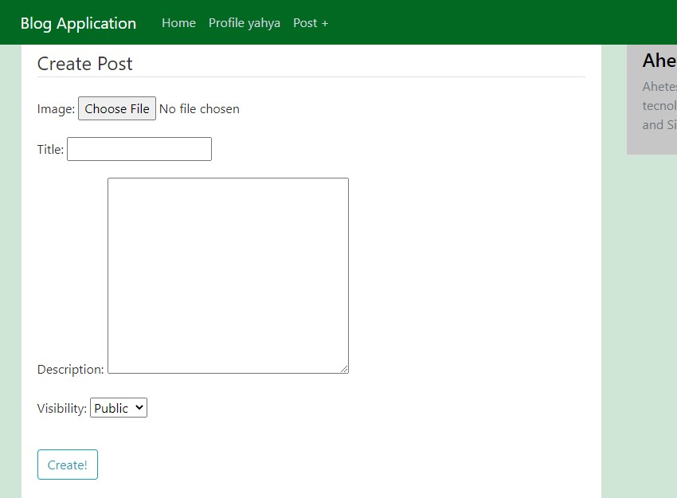

# Blog-Post-Django
Demo live [click](https://blogsappdjango.herokuapp.com/).

```
You should provide a  new user registration page, which should contain three inputs i.e 
Username, 
Password, 
Confirm Password, and 
an arithmetic captcha (Place a check for existing usernames, place a check for an alphanumeric password which is at least 8 characters long, Place a check for Confirming two passwords and Place a simple arithmetic captcha verification for example 2+3=? ) 

You should provide a login page with two inputs i.e 
username and 
password.  

After Being Logged in, the user should be able to create an article with two mandatory fields i.e 
Description and 
an image (You can add other fields if you want) and 
save it either in PUBLIC or PRIVATE mode. 

The Welcome page after logging in should show the user’s own posted articles(If any) and 
a link to create new articles(Shown in Step-3).  
Logged in users should have the ability to search other users and look at their PUBLIC articles only(exclude the PRIVATE articles). 
The user should be able to Log out and be reverted back to the login page.
```

## Homepage


## SIGNUP


## LOGIN


## USER POST


## CREATE POST 


## POST DELETE UPDATE


## UPDATE POST

